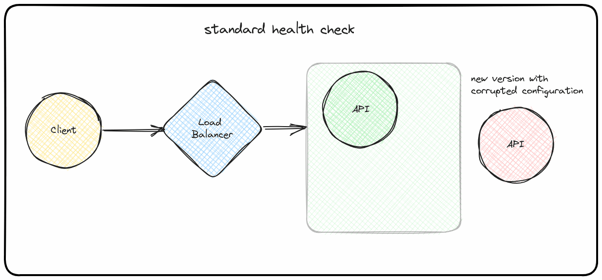
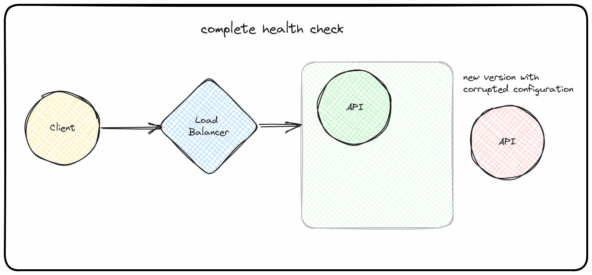
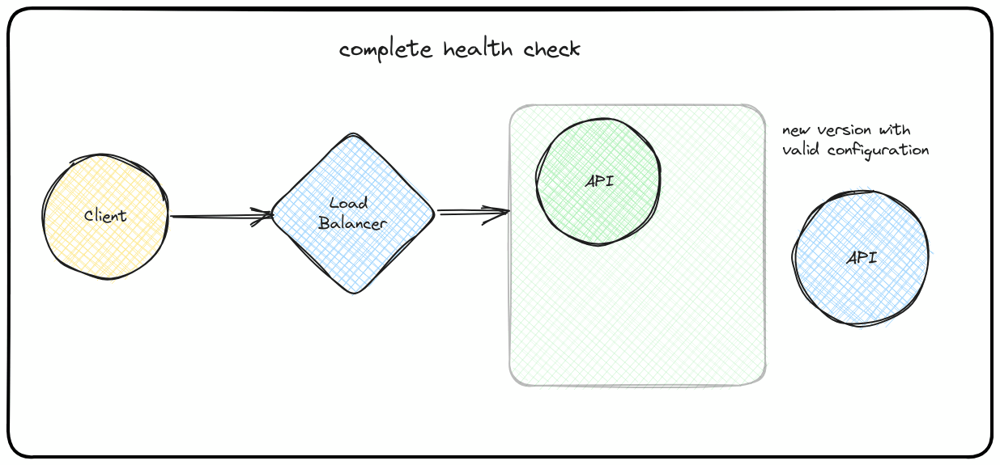

# Complete Health Checks

Minimal working example design to introduce **Complete Health Checks** in comparison to health checks.

## Content

This repository contains the following:
- Micro API
- Compose manifest
- Test script

## Usage

Run the API:
```console
$ uv init
$ uv run fastapi run main.py
```

Then we can perform requests on our micro API:
```console
$ curl -v localhost:8000/health
{"message":"healthy"}
$ curl -v localhost:8000/health-full
{"message":"complete health check is healthy"}
```

## Context

Using Complete health checks, we want to prevent situations in which a new
deployment can cascade and impact an existing system or actual users.

### Standard

When relying on "health check" that only expose liveness, i.e. _serving health checks_, we can not be sure that the other
routes that depend on the database or the cache will behave
properly.



### Complete health check

By checking reachability during the new deployment release, we can assure
that there is no misconfiguration.

If something is not properly set, the new release will not be allowed to serve customer traffic and the deployement is cancelled.



Now, if everything is configured as required, things are smooth
and we reduced the risk of impacting other services or our customers.


